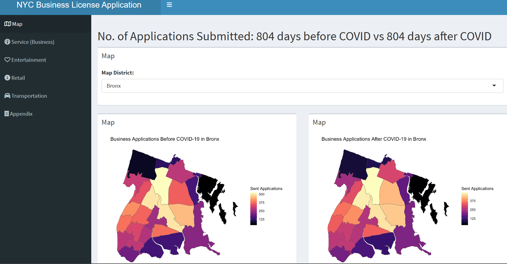

# Project 2: Shiny App Development

### [Project Description](doc/project2_desc.md)

Term: Spring 2023



## Project Title: NYC Business Permit Applications and COVID-19
Term: Spring 2023

+ Team # 5
+ **Team members**:
	+ Luke Arceneaux
	+ Hongju Ooyang
	+ Ranran Tao
	+ Mingze Xu
	+ Fei Xue
	+ Haoyu Zhang

+ **Project summary**: This R Shiny application visualizes the number of sent applications and how successful they were over time since 2014, separated by borough. To see how different sectors were affected, businesses are separated into 4 categories: Services and Business, Entertainment, Retail, and Transportation. This app highlights the specific socioeconomic impacts COVID-19 had from the perspective of business owners and its patrons. All data is drawn from NYC Open Data.

**[Here](https://zhanghaoyu0.shinyapps.io/Stats5243/)** is our app.

+ **Contribution statement**: ([default](doc/a_note_on_contributions.md)) All team members contributed equally in all stages of this project. All team members approve our work presented in this GitHub repository including this contributions statement. 

Following [suggestions](http://nicercode.github.io/blog/2013-04-05-projects/) by [RICH FITZJOHN](http://nicercode.github.io/about/#Team) (@richfitz). This folder is orgarnized as follows.

```
proj/
├── app/
├── lib/
├── data/
├── doc/
└── output/
```

Please see each subfolder for a README file.

